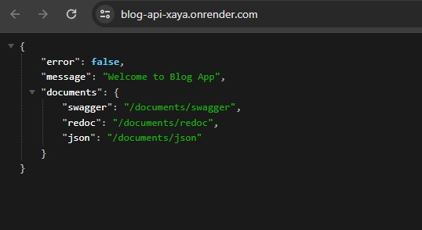

# blogapp-fs-backend

Blog app is a project that you can see, like and comment other's blogs, you can create your blog, update and delete. And this repo is the backend side of the project. To see the frontend repo you can visit [blogapp-fs-frontend repo.](https://github.com/Hasan-Turkel/blogapp-fs-frontend)  

## [Click to see live link](https://blog-api-xaya.onrender.com/)

## This is how the site looks like.

